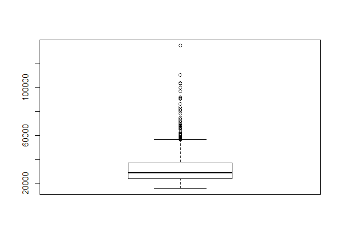

[Data
Política](https://www.youtube.com/channel/UCjsP5ejsSyUchRl2oA96J3A)

Introducción
------------

Te sugiero ver el siguiente **tutorial** y luego aplicar los comandos de
esta página:

<iframe width="560" height="315" src="https://www.youtube.com/embed/XtDQD25Ejkc?rel=0&amp;autoplay=1" frameborder="0" allow="accelerometer; autoplay; encrypted-media; gyroscope; picture-in-picture" allowfullscreen>
</iframe>
### Pasos previos

Solicitamos nuestra base de datos:

    library(rio)
    baseSOSS="https://github.com/DataPolitica/salidas/raw/master/Data/trabajadores.sav"
    trabajadores=import(baseSOSS)

Identificamos las variables que tenemos:

    names(trabajadores)

    ##  [1] "id"              "sexo"            "fechnac"         "educ"           
    ##  [5] "catlab"          "salario_actual"  "salario_inicial" "antiguedad"     
    ##  [9] "experiencia"     "minoría"         "directivo"

### Generamos nuestro modelo de regresión

    modelo1=lm(salario_actual~salario_inicial,data=trabajadores)
    summary(modelo1)

    ## 
    ## Call:
    ## lm(formula = salario_actual ~ salario_inicial, data = trabajadores)
    ## 
    ## Residuals:
    ##    Min     1Q Median     3Q    Max 
    ## -35424  -4031  -1154   2584  49293 
    ## 
    ## Coefficients:
    ##                  Estimate Std. Error t value Pr(>|t|)    
    ## (Intercept)     1.928e+03  8.887e+02    2.17   0.0305 *  
    ## salario_inicial 1.909e+00  4.741e-02   40.28   <2e-16 ***
    ## ---
    ## Signif. codes:  0 '***' 0.001 '**' 0.01 '*' 0.05 '.' 0.1 ' ' 1
    ## 
    ## Residual standard error: 8115 on 472 degrees of freedom
    ## Multiple R-squared:  0.7746, Adjusted R-squared:  0.7741 
    ## F-statistic:  1622 on 1 and 472 DF,  p-value: < 2.2e-16

Para realizar el análisis debemos seguir los pasos de nuestro
flujograma:

<table style="width:39%;">
<colgroup>
<col width="19%" />
<col width="19%" />
</colgroup>
<thead>
<tr class="header">
<th>Pasos</th>
<th>Análisis</th>
</tr>
</thead>
<tbody>
<tr class="odd">
<td>Nuestro modelo es válido?</td>
<td>El p valor de nuestra tabla anova es menor que 0.05, por lo que rechazamos la hipótesis nula (H0:El modelo no es válido) y concluimos que el modelo es válido</td>
</tr>
<tr class="even">
<td>Cuánto explica nuestro modelo?</td>
<td>Según el R2 ajustado podemos afirmar que nuestro modelo explica el 77% de la variabilidad de la variable dependiente.</td>
</tr>
<tr class="odd">
<td>La variable X aporta al modelo?</td>
<td>Analizamos la tabla de coeficientes. Vemos que en la línea de nuestra variable independiente, el p valor es menor a 0.05 por lo que rechazamos la hipótesis nula (H0: La variable no aporta al modelo) y concluimos que sí aporta al modelo.</td>
</tr>
</tbody>
</table>

### Identificamos los coeficientes y construimos la ecuación

    modelo1$coefficients

    ##     (Intercept) salario_inicial 
    ##      1928.20576         1.90945

Recordemos la forma de la ecuación:

y = a + bx

Entonces, de acuerdo al output, vemos que nuestra ecuación sería de la
siguiente manera:

Salario actual = 1928.20576 + (1.90945 \* Salario inicial)

En donde: 1928.20576 es nuestro intercepto y 1.90945 es nuestra
pendiente (b) de x.

Este último se puede interpretar como "el cambio que se presenta en Y
por cada unidad que varía X".

Note that the `echo = FALSE` parameter was added to the code chunk to
prevent printing of the R code that generated the plot.

    boxplot(trabajadores$salario_actual)

